## How to assemble the beetlebot car

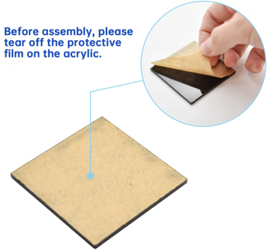

Step 1

Required Parts

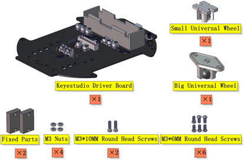

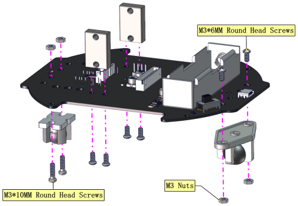

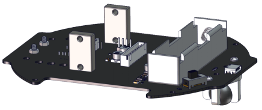

Step 2

Required Parts

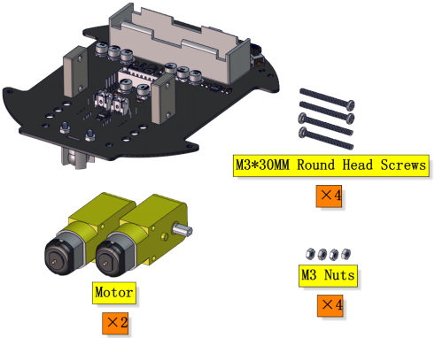

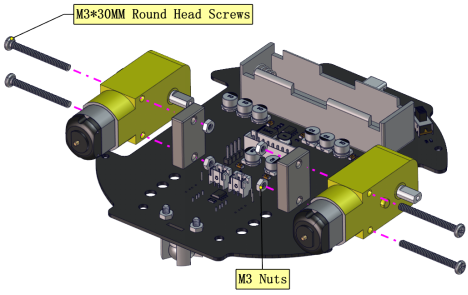

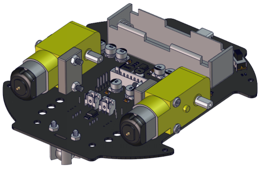

Step 3

Required Parts

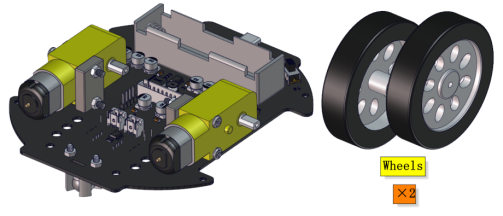

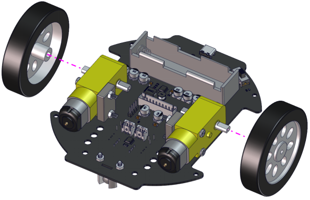

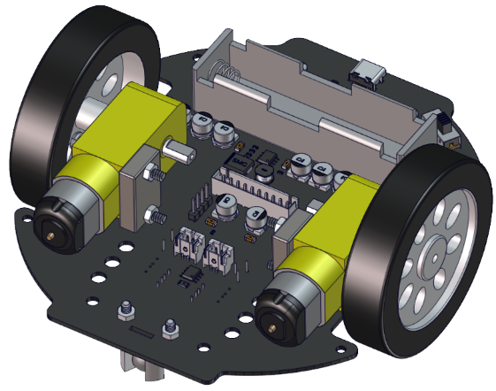

Step 4

Required Parts

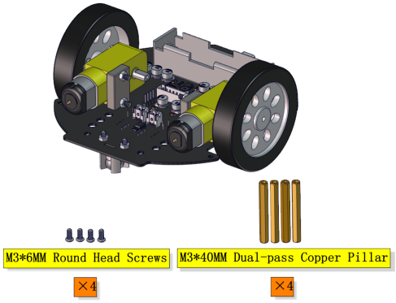

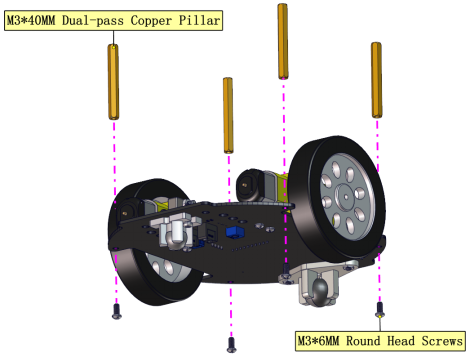

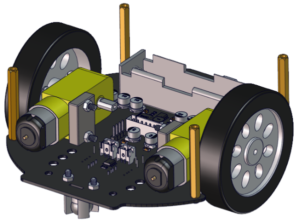

Step 5

Required Parts

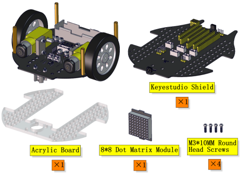

| Left Motor | Right Motor |
| ---------- | ----------- |
| L          | R           |

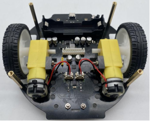

| 8*8 Dot Matrix Display | PCB  |
| ---------------------- | ---- |
| G                      | G    |
| 5V                     | 5V   |
| SDA                    | SDA  |
| SCL                    | SCL  |

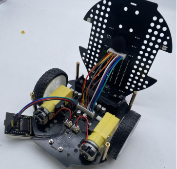

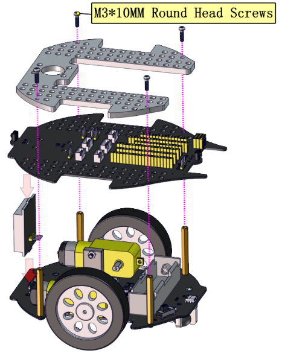

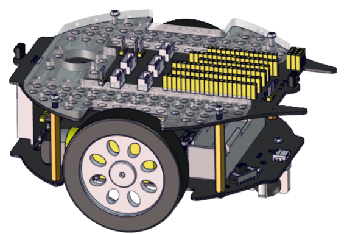

Step 6

Required Parts

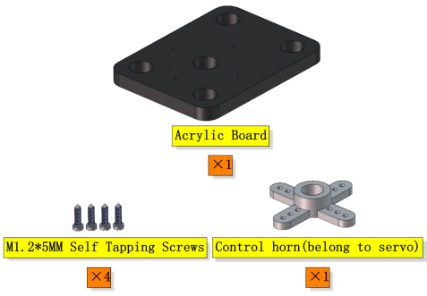

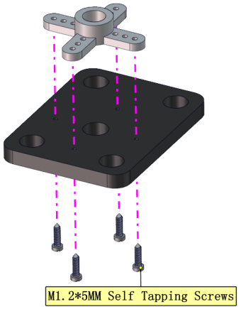

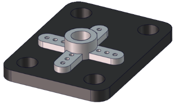

Step 7

Required Parts

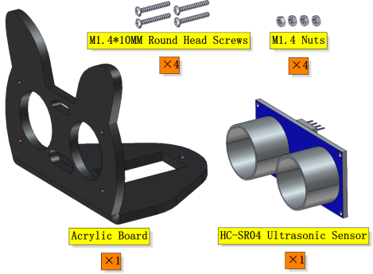

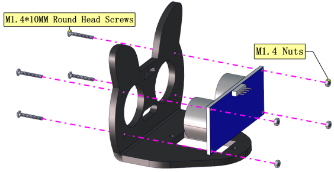

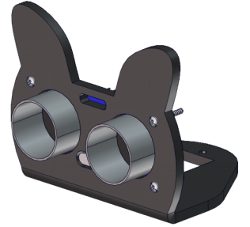

Step 8

Required Parts

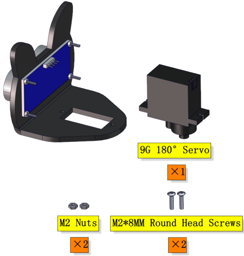

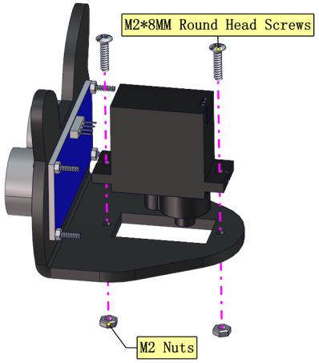

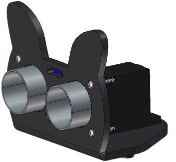

Step 9

Required Parts

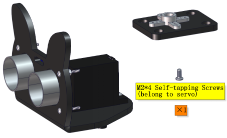

Adjust the angle of the servo to 90 degree. 

| Servo       | PCB      |
| ----------- | -------- |
| Brown line  | G        |
| Red line    | 5V       |
| Orange line | S1（D9） |

```c++
int servoPin = 9; //Define the pins of the steering gear
void setup() {
  pinMode(servoPin, OUTPUT); //steering pin is set to output
  servopulse(servoPin, 90); //Turn it to 90 degrees
  delay(300); //delay 0.3S
}
void loop(){
}
void servopulse(int pin, int myangle) { //Impulse function
  int pulsewidth = map(myangle, 0, 180, 500, 2500); //Map Angle to pulse width
  for (int i = 0; i < 5; i++) { //Output a few more pulses
    digitalWrite(pin, HIGH);//Set the steering gear interface level to high
    delayMicroseconds(pulsewidth);//Number of microseconds of delayed pulse width value
    digitalWrite(pin, LOW);//Lower the level of steering gear interface
    delay(20 - pulsewidth / 1000);
  }
}    digitalWrite(pin, LOW);//Lower the level of steering gear interface
    delay(20 - pulsewidth / 1000);
  }
}
```

**before installing the car**

Copy the above code to the main board of the Beetlebot car.You also can adjust the initial angle of the servo via Scratch-KidsBlock code.

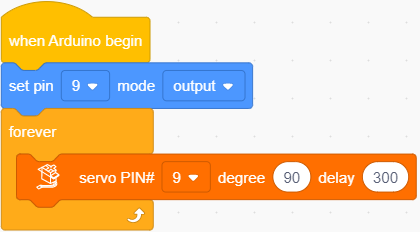

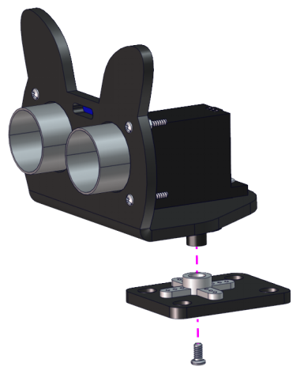

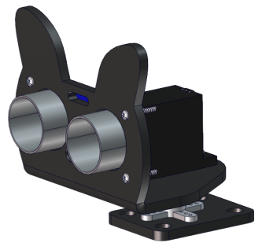

Step 10

Required Parts

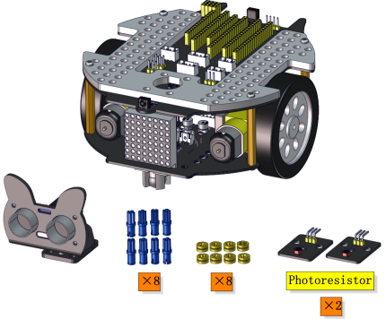

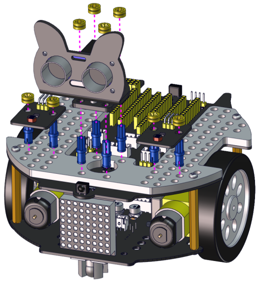

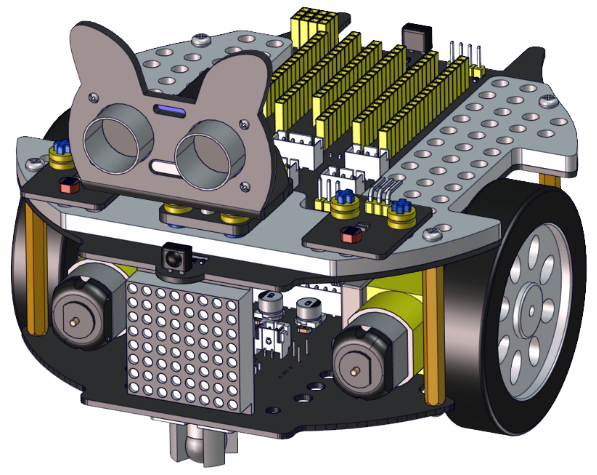

Step 11

Required Parts

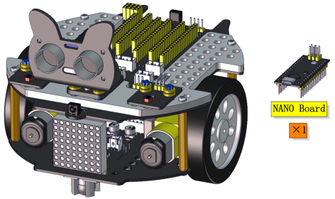

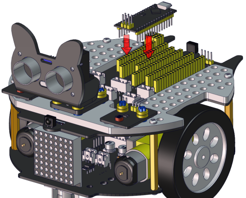

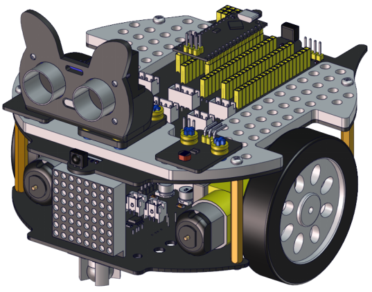

Step 12

Required Parts

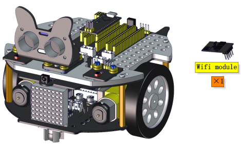

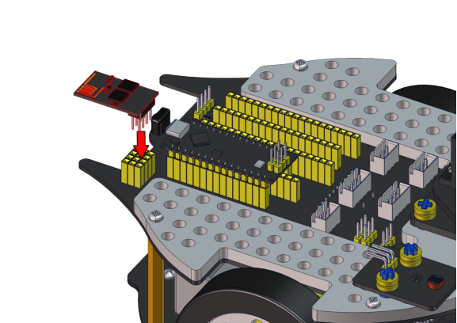

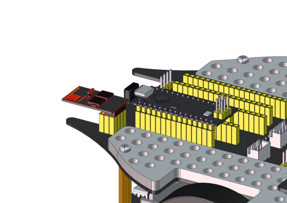

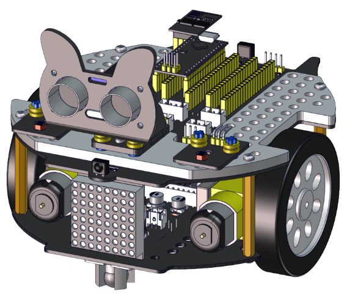

**Wire up the ultrasonic sensor**

| Ultrasonic Sensor | PCB      |
| ----------------- | -------- |
| Vcc               | 5V       |
| Trig              | S2（D8） |
| Echo              | S1（D7） |
| Gnd               | G        |

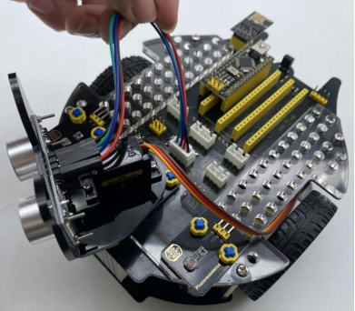

**Wire up the servo**

| Servo       | PCB      |
| ----------- | -------- |
| Brown line  | G        |
| Red line    | 5V       |
| Orange line | S1（D9） |

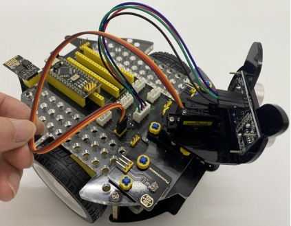

**Wire up the left photoresistor**

| Left photoresistor | PCB     |
| ------------------ | ------- |
| G                  | G       |
| V                  | V       |
| S                  | S（A6） |

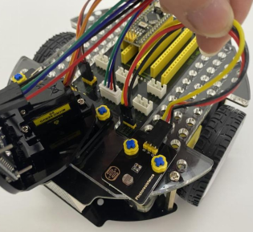

**Wire up the right photoresistor**

| Right photoresistor | PCB     |
| ------------------- | ------- |
| G                   | G       |
| V                   | V       |
| S                   | S（A7） |

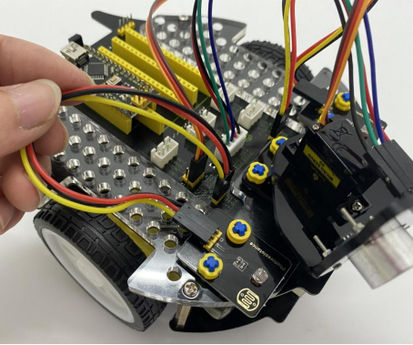

**Beetle Robot Car**

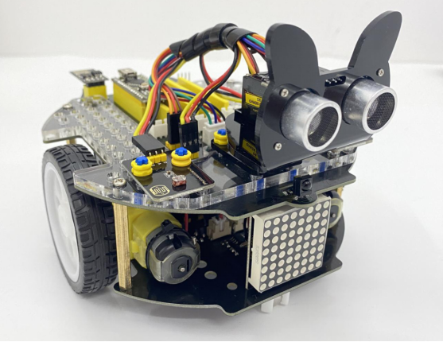
