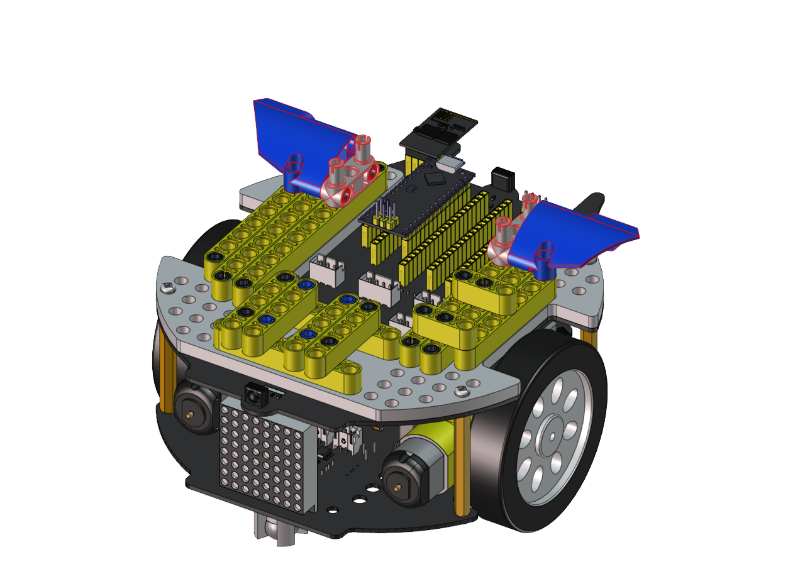
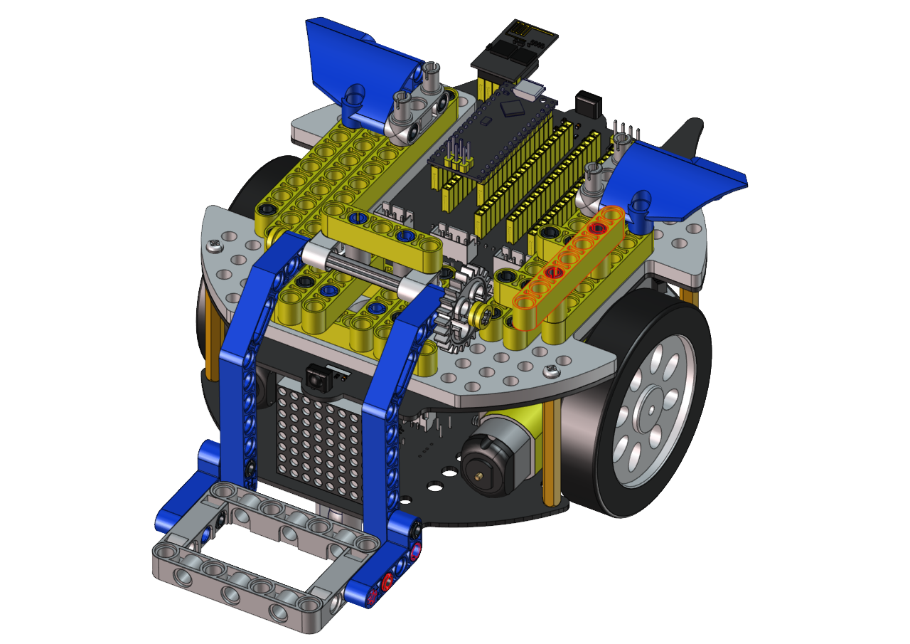
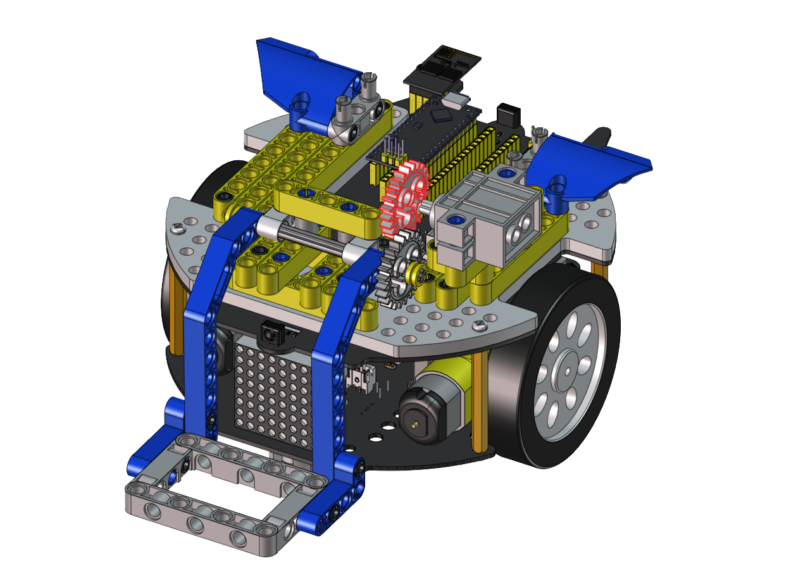

# **Handling Robot tutorial**

## **Description：**

Among many industrial robots, handling robots are undoubtedly effective, applied in industrial manufacturing, warehousing and logistics, tobacco, medicine, food, chemical and other industries, or in post offices, libraries, ports and parking lots. In this experiment, we will use LEGO blocks to build a handling robot to carry things.

## **How to build up a handling robot**

| How to install the handling robot                                                                                                                                                                                                                                                                 
|------------------------------------------------------------------------------------------
|  Step 1                                                                                                                                                                                                                                                                                                                                                                                                                                                                                           |                                                                                                                                                                                                                                                    |           |
|  Dismantle the ultrasonic sensor                                                                                                                                                                                                                                                                                                                                                                                                                                                                 |                |           |
|   Required components                                                                                                                                                                                                                                                                                                                                                                                                                                                                            |            |           |
|                  |                                                                                                                                                                                                                                                    |           |
| Step 2                                                                                                                                                                                                                                                                                                                                                                                                                                                                                           |                                                                                                                                                                                                                                                    |           |
|  Required components                                                                                                                                                                                                                                                                                                                                                                                                                                                                             |            |           |
|                  |                                                                                                                                                                                                                                                    |           |
| Step 3                                                                                                                                                                                                                                                                                                                                                                                                                                                                                           |                                                                                                                                                                                                                                                    |           |
|  Required components                                                                                                                                                                                                                                                                                                                                                                                                                                                                             |            |           |
|                |                                                                                                                                                                                                                                                    |           |
| Step 4                                                                                                                                                                                                                                                                                                                                                                                                                                                                                           |                                                                                                                                                                                                                                                    |           |
|  Required components                                                                                                                                                                                                                                                                                                                                                                                                                                                                             |          |           |
|              |                                                                                                                                                                                                                                                    |           |
| Step 5                                                                                                                                                                                                                                                                                                                                                                                                                                                                                           |                                                                                                                                                                                                                                                    |           |
|  Required components                                                                                                                                                                                                                                                                                                                                                                                                                                                                             |          |           |
|              |                                                                                                                                                                                                                                                    |           |
| Step 6                                                                                                                                                                                                                                                                                                                                                                                                                                                                                           |                                                                                                                                                                                                                                                    |           |
|  Required components                                                                                                                                                                                                                                                                                                                                                                                                                                                                             |          |           |
|              |                                                                                                                                                                                                                                                    |           |
| Step 7                                                                                                                                                                                                                                                                                                                                                                                                                                                                                           |                                                                                                                                                                                                                                                    |           |
|  Required components                                                                                                                                                                                                                                                                                                                                                                                                                                                                             |          |           |
|              |                                                                                                                                                                                                                                                    |           |
| Step 8                                                                                                                                                                                                                                                                                                                                                                                                                                                                                           |                                                                                                                                                                                                                                                    |           |
|  Required components                                                                                                                                                                                                                                                                                                                                                                                                                                                                             |          |           |
|              |                                                                                                                                                                                                                                                    |           |
| Step 9                                                                                                                                                                                                                                                                                                                                                                                                                                                                                           |                                                                                                                                                                                                                                                    |           |
|   Required components                                                                                                                                                                                                                                                                                                                                                                                                                                                                            |          |           |
|   Set the angle of the servo to 180 degree                                                                                                                                                                                                                                                                                                                                                                                                                                                       |  Wire servo up Servo                                                                                                                                                                                                                               | PCB Board |
|  Brown                                                                                                                                                                                                                                                                                                                                                                                                                                                                                           | G                                                                                                                                                                                                                                                  |           |
| Red                                                                                                                                                                                                                                                                                                                                                                                                                                                                                              | 5V                                                                                                                                                                                                                                                 |           |
| Orange                                                                                                                                                                                                                                                                                                                                                                                                                                                                                           | S2（A0）                                                                                                                                                                                                                                           |           |

Upload the code of the servo to the main board of the Beetlebot car, as shown below

      #include <Servo.h>
      Servo myservo;  // create servo object to control a servo

      void setup() {
        myservo.attach(A0);  // attaches the servo on pin A0 to the servo object
      }

      void loop() {
        myservo.write(180);  // tell servo to go to position
      }

You can also initialize the angle of the servo through the following code


Check the Scratch-KidsBlock code as follows，then upload the code to the main board of the Beetlebot car


 

 

 Step 10

Required components

 

 

 

 

 

 

 

Wire up servo


 


## **Arduino Code：**
```c
#include <Servo.h>
Servo lgservo;
#define ML 4
#define ML_PWM 6
#define MR 2
#define MR_PWM 5
#define servo2 A0

char val;
char wifiData;

void setup() {
  Serial.begin(9600);
  pinMode(ML, OUTPUT);
  pinMode(ML_PWM, OUTPUT);
  pinMode(MR, OUTPUT);
  pinMode(MR_PWM, OUTPUT);
  
  lgservo.attach(A0);
  lgservo.write(180);
}

void loop() {
  if(Serial.available() > 0)
  {
    val = Serial.read();
    Serial.print(val);
  }
  switch(val)
  {
    case 'F': car_forward(); break;
    case 'B': car_back(); break;
    case 'L': car_left(); break;
    case 'R': car_right(); break;
    case 'S': car_stop(); break;
    case 'p': lgservo.write(130); break;
    case 'x': lgservo.write(180); break;
  }
}


void car_forward()
{
  digitalWrite(ML,LOW);
  analogWrite(ML_PWM,127);
  digitalWrite(MR,LOW);
  analogWrite(MR_PWM,127);
}

void car_back()
{
  digitalWrite(ML,HIGH);
  analogWrite(ML_PWM,127);
  digitalWrite(MR,HIGH);
  analogWrite(MR_PWM,127);
}

void car_left()
{
  digitalWrite(ML,HIGH);
  analogWrite(ML_PWM,150);
  digitalWrite(MR,LOW);
  analogWrite(MR_PWM,105);
}

void car_right()
{
  digitalWrite(ML,LOW);
  analogWrite(ML_PWM,105);
  digitalWrite(MR,HIGH);
  analogWrite(MR_PWM,150);
}

void car_stop()
{
  digitalWrite(ML,LOW);
  analogWrite(ML_PWM,0);
  digitalWrite(MR,LOW);
  analogWrite(MR_PWM,0);
}
```

## **Kidsblock Code：**


Connect Wifi, click buttons to make the car to move toward building blocks and put some building blocks on the robot.

Then press to drive the robot to move.

Hold down the button to drive the robot to drop building blocks, then building blocks can be conveyed
