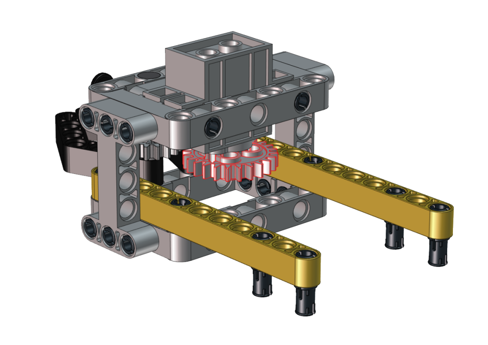
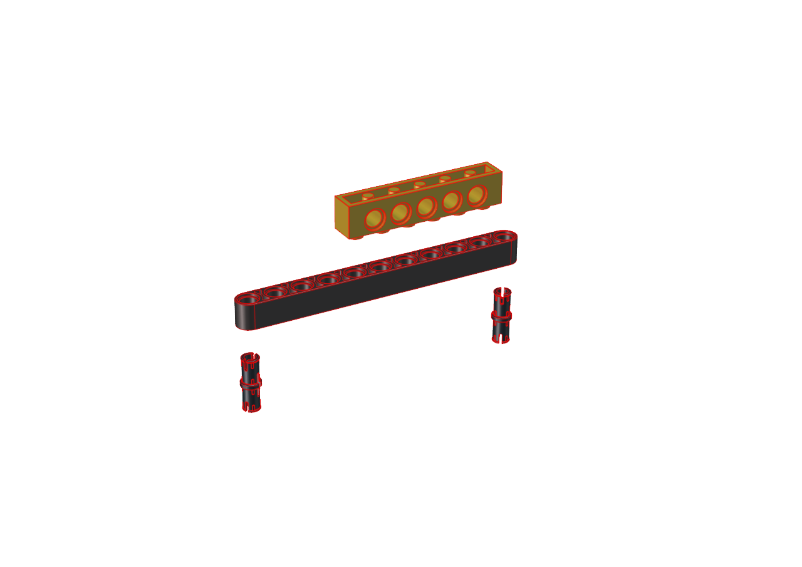
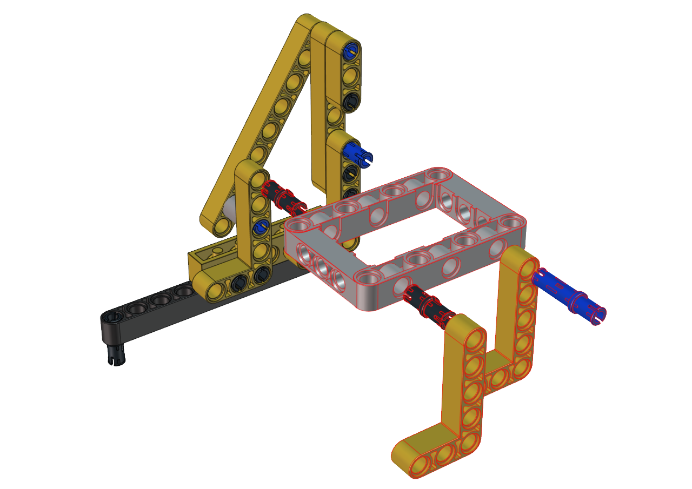
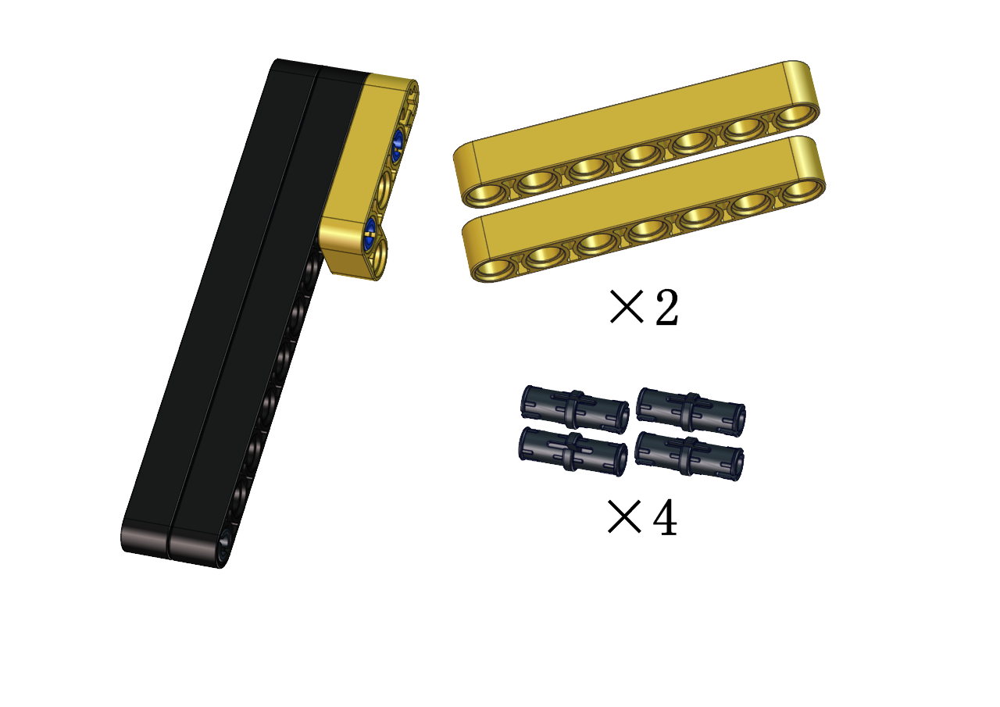
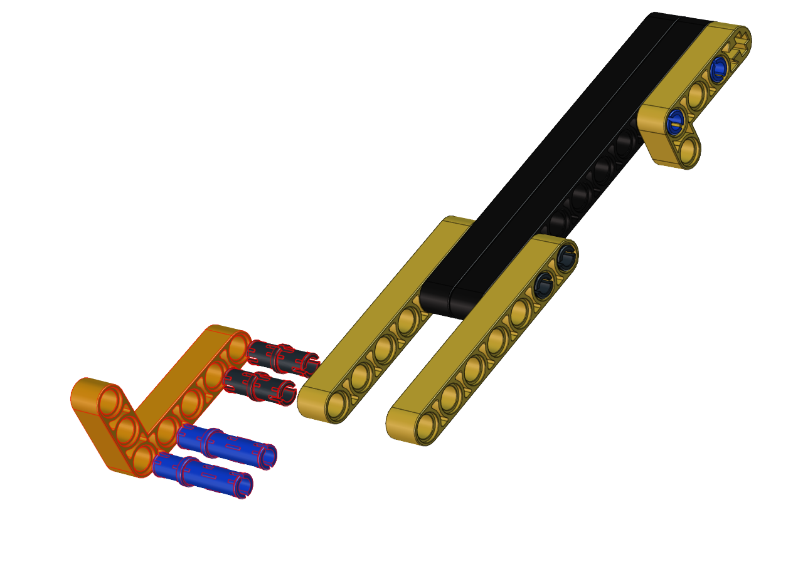
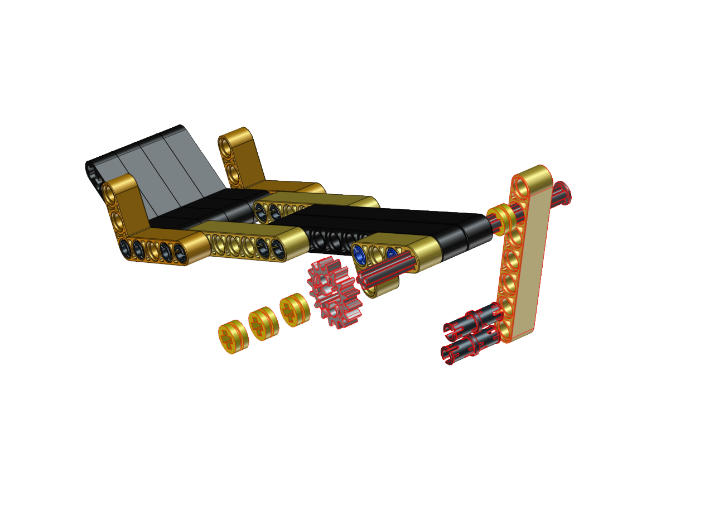
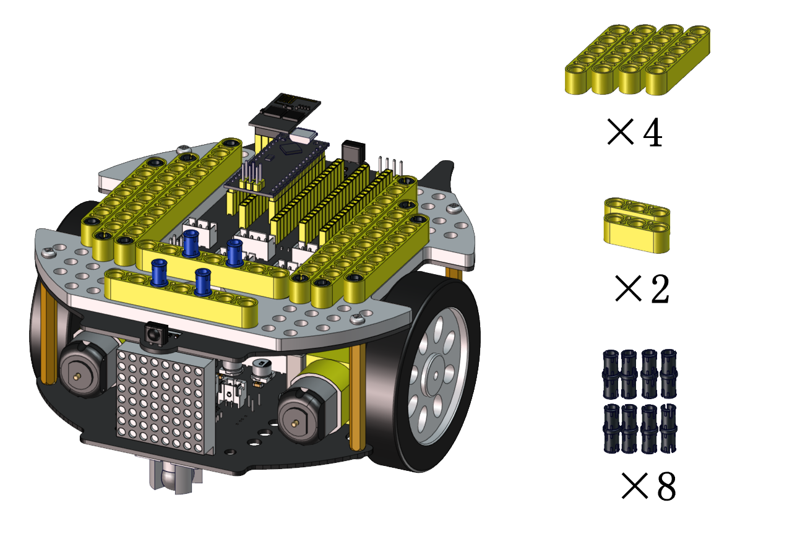
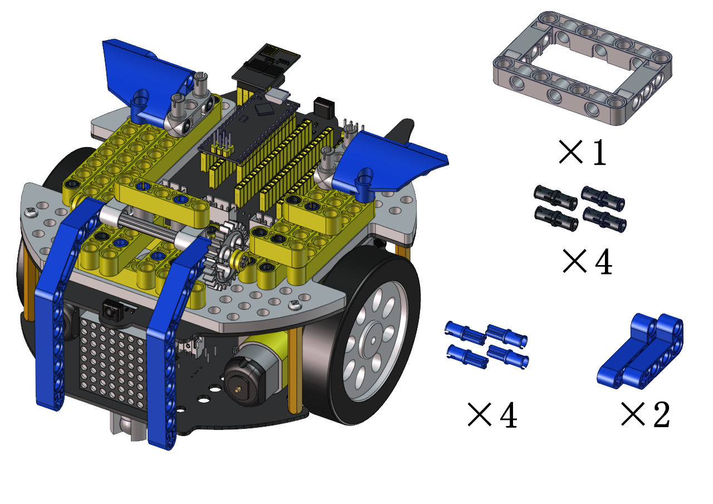
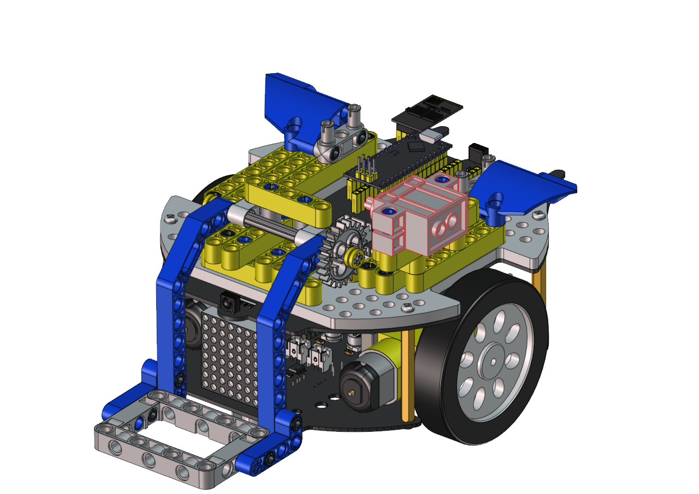

# **Soccer tutorial**


## 1. Description：

Can you imagine that a robot can play soccer? This idea has became realistic. As we know, the RoboCup championship is generally held each year. In this part, we will create a soccer robot to play soccer.

## 2. How to install the soccer robot:

**Step 1:** 

Remove two photoresistors first


**Step 2:** 


 


**Step 3:** 


  

 

**Step 4:**


 


**Step 5:**


  


**Step 6:**


  


**Step 7:**


Note the installation direction of the part marked by the red circle 


   


**Step 8:**


 


**Step 9:**

 

Adjust the angle of the claw. Then make it close and face front. 

 


**Step 10:**

Set the angle of the servo to 180 degree


Upload the code of the servo to the main board of the Beetlebot car, as shown below

```c
#include <Servo.h>
Servo myservo;  // create servo object to control a servo

void setup() {
   myservo.attach(A0);  // attaches the servo on pin A0 to the servo object
}

void loop() {
  myservo.write(180);  // tell servo to go to position
}

```

You can also initialize the angle of the servo through the following code


Keep the claw close and face front before installing the gear




**Step 11:**

Required Parts


**Step 12:**

Required Parts


**Step 13:**


------

<span style="color: rgb(255, 76, 65);">**We adopt a model 18650 lithium battery with a pointed positive pole, whose power and capacity are not required.**</span>


------

## 3. Install a soccer goal

**Step 1:**


  


**Step 2:**


  


**Step 3:**


  


## 4. Codes:

### (1)Arduino Code：
```c
#include <Servo.h>
Servo lgservo;
#define ML 4
#define ML_PWM 6
#define MR 2
#define MR_PWM 5
#define servo2 A0

char val;
char wifiData;

void setup() {
  Serial.begin(9600);
  pinMode(ML, OUTPUT);
  pinMode(ML_PWM, OUTPUT);
  pinMode(MR, OUTPUT);
  pinMode(MR_PWM, OUTPUT);
  
  lgservo.attach(A0);
  lgservo.write(180);
  delay(1000);
  lgservo.write(160);
}

void loop() {
  if(Serial.available() > 0)
  {
    val = Serial.read();
    Serial.print(val);
  }
  switch(val)
  {
    case 'F': car_forward(); break;
    case 'B': car_back(); break;
    case 'L': car_left(); break;
    case 'R': car_right(); break;
    case 'S': car_stop(); break;
    case 'p': lgservo.write(180); break;
    case 'x': lgservo.write(160); break;
  }
}


void car_forward()
{
  digitalWrite(ML,LOW);
  analogWrite(ML_PWM,127);
  digitalWrite(MR,LOW);
  analogWrite(MR_PWM,127);
}

void car_back()
{
  digitalWrite(ML,HIGH);
  analogWrite(ML_PWM,127);
  digitalWrite(MR,HIGH);
  analogWrite(MR_PWM,127);
}

void car_left()
{
  digitalWrite(ML,HIGH);
  analogWrite(ML_PWM,150);
  digitalWrite(MR,LOW);
  analogWrite(MR_PWM,105);
}

void car_right()
{
  digitalWrite(ML,LOW);
  analogWrite(ML_PWM,105);
  digitalWrite(MR,HIGH);
  analogWrite(MR_PWM,150);
}

void car_stop()
{
  digitalWrite(ML,LOW);
  analogWrite(ML_PWM,0);
  digitalWrite(MR,LOW);
  analogWrite(MR_PWM,0);
}
```

### (2)Kidsblock Code：


## 5. Test Result：

<span style="color: rgb(255, 76, 65);">Note:</span> Please refer to the Project 11.2 of the Arduino tutorial for downloading and operating the APP.
<br>
<br>

Build up the soccer goal with building blocks and place it at fixed location, connect the robot car through Wifi.

Put a small soccer in the middle of the claw of the robot car, press and hold down the button to enable the claw to hold the soccer, then press buttons to adjust the car’s movement direction so as to put the soccer close to the soccer goal. At last, release the button to allow the soccer to drop on the floor and roll to the soccer goal. If not, repeat the above step to shoot the goal.

If your friend owns this kind of soccer robot, you guys can hold a soccer match. It sounds amazing, right?


# **Catapul tutorial**


## **1. Description：**

A catapult is a ballistic device used to launch a projectile a great distance without the aid of gunpowder or other propellants – particularly various types of ancient and medieval siege engines. ... We will make a catapult with LEGO building blocks. Equipped with servos and gears, the car has LEGO tower used to carry projectiles.

As the servo rotates to a proper angle then push the long arm backward a projectile will be launched.

## **2. How to build up a catapult**

**Step 1:**

   

 


**Step 2:**

 


 

**Step 3:**

  

   

 

**Step 4:**

    

   

 

**Step 5:**

  

 


**Step 6:**

 

  
 
 

**Step 7:**

   

   


**Step 8:**

   
 
   


**Step 9:**


**Step 10:**

 


**Step 11:**





**Step 12:**

 

 
 


**Step 13:**

   

   


**Step 14:**

 

  


**Step 15:**

   

   


**Step 16:**

   

   


**Step 17:**

Set the angle of the servo to 0 degree


Upload the code of the servo to the main board of the Beetlebot car, as shown below

```c
#include <Servo.h>
Servo myservo;  // create servo object to control a servo

void setup() {
   myservo.attach(A0);  // attaches the servo on pin A0 to the servo object
}

void loop() {
   myservo.write(0);  // tell servo to go to position
}
```

You can also initialize the angle of the servo through the following code


Check the Scratch-KidsBlock code as follows，then upload the code to the main board of the Beetlebot car


**Step 18:**


**Step 19:** Wire up

Interface the servo


------

<span style="color: rgb(255, 76, 65);">**We adopt a model 18650 lithium battery with a pointed positive pole, whose power and capacity are not required.**</span>


------

## 3. Code:

### (1) Arduino Code：

```c
#include <Servo.h>
Servo lgservo;
#define ML 4
#define ML_PWM 6
#define MR 2
#define MR_PWM 5
#define servo2 A0

char val;
char wifiData;
boolean servo_flag = 1;

void setup() {
  Serial.begin(9600);
  pinMode(ML, OUTPUT);
  pinMode(ML_PWM, OUTPUT);
  pinMode(MR, OUTPUT);
  pinMode(MR_PWM, OUTPUT);
  
  lgservo.attach(A0);
  lgservo.write(0);
}

void loop() {
  if(Serial.available() > 0)
  {
    val = Serial.read();
    Serial.print(val);
  }
  switch(val)
  {
    case 'F': car_forward(); break;
    case 'B': car_back(); break;
    case 'L': car_left(); break;
    case 'R': car_right(); break;
    case 'S': car_stop(); break;
    case 'p': lgservo.write(55);servo_flag = 1; break;
    case 'x': servo_down(); break;
  }
}

void servo_down()
{
  while( servo_flag == 1)
  {
    for(int i=55; i>0; i--)
    {
      lgservo.write(i);
      delay(2);
    }
    servo_flag = 0;
  }
  
}


void car_forward()
{
  digitalWrite(ML,LOW);
  analogWrite(ML_PWM,255);
  digitalWrite(MR,LOW);
  analogWrite(MR_PWM,255);
}

void car_back()
{
  digitalWrite(ML,HIGH);
  analogWrite(ML_PWM,0);
  digitalWrite(MR,HIGH);
  analogWrite(MR_PWM,0);
}

void car_left()
{
  digitalWrite(ML,HIGH);
  analogWrite(ML_PWM,150);
  digitalWrite(MR,LOW);
  analogWrite(MR_PWM,105);
}

void car_right()
{
  digitalWrite(ML,LOW);
  analogWrite(ML_PWM,105);
  digitalWrite(MR,HIGH);
  analogWrite(MR_PWM,150);
}

void car_stop()
{
  digitalWrite(ML,LOW);
  analogWrite(ML_PWM,0);
  digitalWrite(MR,LOW);
  analogWrite(MR_PWM,0);
}

```

### (2) Kidsblock Code：


## 4. Test Result：

<span style="color: rgb(255, 76, 65);">Note:</span> Please refer to the Project 11.2 of the Arduino tutorial for downloading and operating the APP.
<br>
<br>

Build up a few target objects with building blocks(object A, B, C, D, E) and keep them in a certain distance away the catapult and connect Wifi.

Click  to make the car to face the object A, hold down the button to drive the catapult to launch a building block.

Then release the button to make the long arm return to the original state. Next, let’s check if the object A is hit by the launched block

You can repeat above steps to hit the object B, C and D.


# **Handling tutorial**


## 1. Description：

Among many industrial robots, handling robots are undoubtedly effective, applied in industrial manufacturing, warehousing and logistics, tobacco, medicine, food, chemical and other industries, or in post offices, libraries, ports and parking lots. In this experiment, we will use LEGO blocks to build a handling robot to carry things.

## 2. How to build up a handling robot:

**Step 1:**

Dismantle the ultrasonic sensor


**Step 2:**


   


**Step 3:**



 


**Step 4:**


  


**Step 5:**


 


**Step 6:**


 


**Step 7:**

 

 

 

**Step 8:**


   


**Step 9:**


   



**Step 10:**

Set the angle of the servo to 180 degree


Upload the code of the servo to the main board of the Beetlebot car, as shown below

```c
#include <Servo.h>

Servo myservo;  // create servo object to control a servo

void setup() {
    myservo.attach(A0);  // attaches the servo on pin A0 to the servo object
}

void loop() {
    myservo.write(180);  // tell servo to go to position
}
```

You can also initialize the angle of the servo through the following code


**Step 11:**


 


**Step 12:** Wire up servo


------

<span style="color: rgb(255, 76, 65);">**We adopt a model 18650 lithium battery with a pointed positive pole, whose power and capacity are not required.**</span>


------

## 3. Code:

### (1)Arduino Code：

```c
#include <Servo.h>
Servo lgservo;
#define ML 4
#define ML_PWM 6
#define MR 2
#define MR_PWM 5
#define servo2 A0

char val;
char wifiData;

void setup() {
  Serial.begin(9600);
  pinMode(ML, OUTPUT);
  pinMode(ML_PWM, OUTPUT);
  pinMode(MR, OUTPUT);
  pinMode(MR_PWM, OUTPUT);
  
  lgservo.attach(A0);
  lgservo.write(180);
}

void loop() {
  if(Serial.available() > 0)
  {
    val = Serial.read();
    Serial.print(val);
  }
  switch(val)
  {
    case 'F': car_forward(); break;
    case 'B': car_back(); break;
    case 'L': car_left(); break;
    case 'R': car_right(); break;
    case 'S': car_stop(); break;
    case 'p': lgservo.write(130); break;
    case 'x': lgservo.write(180); break;
  }
}


void car_forward()
{
  digitalWrite(ML,LOW);
  analogWrite(ML_PWM,127);
  digitalWrite(MR,LOW);
  analogWrite(MR_PWM,127);
}

void car_back()
{
  digitalWrite(ML,HIGH);
  analogWrite(ML_PWM,127);
  digitalWrite(MR,HIGH);
  analogWrite(MR_PWM,127);
}

void car_left()
{
  digitalWrite(ML,HIGH);
  analogWrite(ML_PWM,150);
  digitalWrite(MR,LOW);
  analogWrite(MR_PWM,105);
}

void car_right()
{
  digitalWrite(ML,LOW);
  analogWrite(ML_PWM,105);
  digitalWrite(MR,HIGH);
  analogWrite(MR_PWM,150);
}

void car_stop()
{
  digitalWrite(ML,LOW);
  analogWrite(ML_PWM,0);
  digitalWrite(MR,LOW);
  analogWrite(MR_PWM,0);
}
```

### (3)Kidsblock Code：**


## 4. Test Result：

<span style="color: rgb(255, 76, 65);">Note:</span> Please refer to the Project 11.2 of the Arduino tutorial for downloading and operating the APP.
<br>
<br>

Connect Wifi, click buttons to make the car to move toward building blocks and put some building blocks on the robot.

Then press to drive the robot to move.

Hold down the button to drive the robot to drop building blocks, then building blocks can be conveyed


