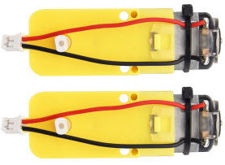
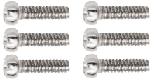

# KS0543 Keyestudio Beetlebot 3 in 1 Robot for scratch

## 1. Description

The Beetlebot smart robot, compatible with LEGO building blocks, is a STEM educational product which can automatically dodge obstacles, follow black lines and light to move. Besides, it has three cool forms such as the soccer robot, the siege robot, the handling robot. As for beginners, they can create whatever they want by LEGO building blocks.

Various improvements have been made on the Beetlebot car in comparison with other smart cars. It integrates a motor driver and a large number of sensors and is easy to assemble.

Going forward, not only can it impart basic programming knowledge and AI application to children and the youth, but also it can cultivate their creativity, hands-on ability, problem-solving capability, interpersonal communication as well as teamwork ability. With this kit, you have a chance to experience soccer games using your own robots.

## 2. Features

-   Compatible with LEGO building blocks: generate diverse forms with LEGO blocks and sensors.
    
-   Three forms: a soccer robot, a siege engine, a handling robot.

-   Various functions: Pictures display, atmosphere light control, line tracking, obstacle avoidance, light following , IR control and WIFI control.
    
-   Easy to build: embedded design on car body; wire up the car body with a few steps.
    
-   High compatibility: reserve ports for the Raspberry Pico board and the ESP32 control board.
    
-   Charging function: integrate a circuit for 18650 batteries, low-cost and effective.
    
-   WiFi Control: adopt WiFi control, can finish tailor-made software development.
    
-   App: compatible with Android and iOS systems, with aesthetic page and flexible control system.

## 3. Specification

Working voltage: 5V

Input voltage: 2.5V\~4.2V (lithium battery)

Maximum output current: 3A

Maximum power consumption: 15W (T=80℃)

Motor speed: 5V 200 rpm / min

Motor drive form: dual H-bridge

Ultrasonic sensing angle: \<15 degrees

Ultrasonic detection distance: 2cm-400cm

IR control distance: about 7 meters (measured)

Size: 176mm\*137mm\*130mm

Environmental protection attributes: ROHS

## 4. Kit List

| \#   | Picture                                                      | Name                                                         | QTY  |
| ---- | ------------------------------------------------------------ | ------------------------------------------------------------ | ---- |
| 1    |               | Keyestudio Nano CH340 Development Board                      | 1    |
| 2    |             | ESP8266 Wifi Module                                          | 1    |
| 3    |          | Keyestudio Photoresistor                                     | 2    |
| 4    |             | 270° Servo                                                   | 1    |
| 5    |             | Keyestudio Development Board                                 | 1    |
| 6    |             | Keyestudio Driver Board                                      | 1    |
| 7    |             | LEGO Bulk Lot                                                | 1    |
| 8    |             | Acrylic Board                                                | 1    |
| 9    |             | MD0487 Acrylic Board for Ultrasonic Sensor                   | 1    |
| 10   |              | Acrylic Board for Servo                                      | 1    |
| 11   |              | 4.5V 200R Motor                                              | 2    |
| 12   |             | 8\*8 Dot Matrix Display                                      | 1    |
| 13   |              | Aluminum Block | 2    |
| 14   |             | 9G 180°Servo                                                 | 1    |
| 15   |             | Car Wheel                                                    | 2    |
| 16   |              | HC-SR04 Ultrasonic Sensor                                    | 1    |
| 17   |             | Screwdriver | 1    |
| 18   |              | W420 Universal Wheel                                         | 1    |
| 19   |       | JMFP-4 17-Key Remote Control                                 | 1    |
| 20   |              | Black USB Cable                                              | 1    |
| 21   |         | Screwdriver                                                  | 1    |
| 22   |              | 3P F-F Dupont Wire                                           | 2    |
| 23   |              | 4P F-F Dupont Wire                                           | 1    |
| 24   |              | HX2.54mm-4P Dupont Wire                                      | 1    |
| 25   |      | Winding Pipe                                                 | 1    |
| 26   |             | 10P XH2.54 Dupont Wire                                       | 1    |
| 27   |             | Acrylic Gasket                                               | 6    |
| 28   |             | M3\*40MM Dual Pass Copper Pillars                            | 4    |
| 29   |             | M1.2\*5MM Round Head Screws                                  | 6    |
| 30   |   | M1.4 Nuts                                                    | 6    |
| 31   |               | M1.4\*10MM Round Head Screws                                 | 6    |
| 32   |             | M2 Nuts                                                      | 3    |
| 33   |             | M2\*8MM Round Head Screws                                    | 3    |
| 34   |                        | M3\*10MM Round Head Screws                                   | 6    |
| 35   |               | M3\*6MM Round Head Screws                                    | 11   |
| 36   |             | M3 Nuts                                                      | 9    |
| 37   |             | M3\*30MM Round Head Screws                                   | 4    |
| 38   |              | Soccer Ball                                                  | 1    |
| 39   |             | W1515 Universal Wheel                                        | 1    |
| 40   |             | 18650 Batteries  KS0543F includes batteries KS0543 doesn't conclude batteries | 1    |
| 41   |        | USB to ESP-01S WIFI Module Expansion Board                   | 1    |
| 42   |                        | M2.3*16MM Round Head Self-tapping Screw                      | 2    |

## 5. PCB Board

****

****

Turn the DIP switch to the OFF end before installing or removing batteries.

## 6. Keyestudio Nano Board

### Description

The processor core of Keyestudio Nano CH340 is ATMEGA328P-AU. It is as same as the official Arduino Nano in addition to driver file and USB to serial chip (CH340G).

It also has 14 digital input / output interfaces (6 of which can be used as PWM output), 8 analog input interfaces, 1 16MHz crystal oscillator, 1 mini USB port, 1 ICSP interface, and a reset button.

The ICSP interface is used to program the Atmega328P-Au. We can supply power with a USB cable, the port VIN GND (DC 7-12V) and GND

### Specification

Microcontroller：ATMEGA328P-AU

Operating Voltage: 5V

Input Voltage (recommended)：DC 7-12V

Digital I/O Pins：14 (D0-D13)

PWM Digital I/O Pins：6 (D3 D5 D6 D9 D10 D11)

Analog Input Pins: 8 (A0-A7)

DC Current per I/O Pin: 40 mA

Flash Memory：32 KB of which 2 KB used by bootloader

SRAM: 2 KB  

EEPROM: 1 KB  

Clock Speed: 16 MHz

LED_BUILTIN: D13

### Pins

| 1    | ICSP Header                      | ICSP(In-Circuit Serial Programming) Header ICSP is the AVR, an micro-program header consisting of MOSI, MISO, SCK, RESET, VCC, and GND. It is often called the SPI (serial peripheral interface) and can be considered an "extension" of output. In fact, slave the output devices under the SPI bus host.When connecting to PC, program the firmware to ATMEGA328P-AU. |
| ---- | -------------------------------- | ------------------------------------------------------------ |
| 2    | LED indicator（RX）              | Onboard you can find the label: RX(receive )When control board communicates via serial port, receive the message, RX led flashes. |
| 3    | LED indicator（TX）              | Onboard you can find the label: TX (transmit)When control board communicates via serial port, send the message, TX led flashes. |
| 4    | LED indicator（POW）             | Power up the control board, LED on, otherwise LED off.       |
| 5    | LED indicator（L）               | There is a built-in LED driven by digital pin 13. When the pin is HIGH value, the LED is on, when the pin is LOW, it's off. |
| 6    | RX0（D0） TX1（D1） D2-D13 | It has 14 digital input/output pins D0-D13 (of which 6 can be used as PWM outputs). These pins can be configured as digital input pin to read the logic value (0 or 1). Or used as digital output pin to drive different modules like LED, relay, etc. |
| 7    | RST                              | Reset pin: connect external button. The function is the same as RESET button. |
| 8    | MEGA 328P                        | Each board has its own microcontroller. You can regard it as the brain of your board.Microcontrollers are usually from ATMEL. Before you load a new program on the Arduino IDE, you must know what IC is on your board. This information can be checked at the top surface of IC.The board’s microcontroller is ATMEGA328P-AU. More info. see the [datasheet ](http://101.96.10.64/ww1.microchip.com/downloads/en/DeviceDoc/Atmel-42735-8-bit-AVR-Microcontroller-ATmega328-328P_Summary.pdf) |
| 9    | MINI USB                         | The board can be powered via Mini-B USB connection. Also upload the program to the board via USB port. |
| 10   | 3V3 pin                          | Provides 3.3V voltage output                                 |
| 11   | REF                              | Reference external voltage (0-5 volts) for the analog input pins. Used with [analogReference()](https://www.arduino.cc/reference/en/language/functions/analog-io/analogreference/). |
| 12   | A0-A7                            | The Nano has 8 Analog Pins, labeled A0 through A7.           |
| 13   | 5V                               | Provides 5V voltage output                                   |
| 14   | GND                              | Ground pin                                                   |
| 15   | VIN                              | Input an external voltage DC7-12V to power the board.        |
| 16   | Reset Button                     | Used to reset the control board                              |
| 17   | CH340G                           | USB-to-serial port chip, converting the USB signal into Serial port signal. |
| 18   | AMS1117                          | Convert the external voltage input DC7-12V into DC5V, then transfer it to the processor and other elements. |

### Specialized Functions of Some Pins:

- **Serial communication:** RX0 and TX1.
- **PWM (Pulse-Width Modulation):** D3, D5, D6, D9, D10, D11
- **External Interrupts:** D2 (interrupt 0) and D3 (interrupt 1)
- **SPI communication:** D10 (SS), D11 (MOSI), D12 (MISO), D13 (SCK).
- **IIC communication:** A4 (SDA); A5(SCL)
